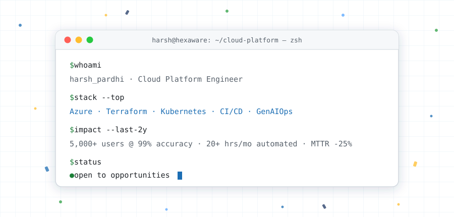

# Harsh Pardhi

 

 

---

## About

Azure engineer at **Hexaware Technologies**, two years in, working across cloud operations, Microsoft 365 migrations and automation for enterprise clients. Most of my work follows one pattern: something is being done by hand, and it shouldn't be. I find it, script it with PowerShell or Python, and put the output somewhere people can act on it.

At work that has meant migrating **5,000+ users** of on-premises OneDrive data into **Microsoft 365** with ShareGate and PowerShell; deploying **StorageX Analytics** against a client's NetApp ONTAP estate and extracting data from **9 storage VMs across 2 clusters** into **10 Power BI reports** on data ownership and ACL exposure; moving **132 Power Apps and 50+ Power Automate flows** to a new tenant; and building **Transcend**, a Power App with a Copilot Studio agent that is now the transformation team's primary project management tool.

Outside work I build infrastructure projects to go deeper — **InfraGenie**, an AIOps platform for Azure, and a **two-region DR environment** in Terraform. **AZ-400** is next, in September.

**📍 Gondia, Maharashtra · 🏢 Hexaware, Chennai · 🌏 Open to relocation & remote · ⏱ IST (UTC+5:30)**

---

## Featured Projects

<table width="100%">
<tr>
<td width="50%" valign="top">

### 🤖 InfraGenie — AIOps Platform for Azure

A self-service platform for Azure infrastructure. An engineer describes what they need in plain English; the platform matches the request to a **reusable Terraform module** and runs policy checks before anything is applied.

After deployment it keeps watching the resource — it **remediates common failures on its own** and logs a **ServiceNow** ticket, so a problem is fixed and recorded rather than escalated at 2 a.m. A reporting agent publishes **10+ operational reports** on a schedule: FinOps spend, weekly digest, orphaned VMs.

> Development cost stayed at zero by running **Qwen2.5-Coder locally on Ollama in Docker** as the coding assistant. I architected the platform and wrote it against **SOLID principles** with structured prompt engineering, so every generated change stayed small and reviewable.

`Python` `Terraform` `Docker` `Ollama` `Qwen2.5-Coder` `ServiceNow`

[**→ Repository**](https://github.com/HP04Harsh/infragenie-aiops) · [**→ Hugging Face**](https://huggingface.co/HarshG05/InfraGenie-Azure-Expert)

</td>
<td width="50%" valign="top">

### 🛡️ Azure Multi-Region Disaster Recovery

A two-region, three-tier Azure environment built to answer one question: **if the primary region fails, how fast can the application come back?** Provisioned entirely in **Terraform** across Central and South India.

**VM Scale Sets** serve the web and application tiers, geo-replicated **Azure SQL** holds the data, and **Traffic Manager** with Load Balancers routes traffic between regions.

> Written as reusable modules with remote state and locking, using an **active/passive** topology so standby cost stayed proportionate to the recovery target instead of doubling the estate.

`Terraform` `Traffic Manager` `VM Scale Sets` `Azure SQL` `Azure Storage`

[**→ Repository**](https://github.com/HP04Harsh/azure-multi-region-dr-terraform)

</td>
</tr>
<tr>
<td width="50%" valign="top">

### ⚙️ KubeScale-Ops — AKS Governance & FinOps

A learning lab for Kubernetes cost governance. **Kubecost and Prometheus** track spend and utilization across the cluster; manifests are GitOps-managed and validated on a **KinD** loop before they reach a real cluster.

Reusable **Terraform** modules with platform guardrails and workload validation for repeatable AKS delivery.

`AKS` `Terraform` `Kubecost` `Prometheus` `Helm` `GitOps`

[**→ Repository**](https://github.com/HP04Harsh/KubeScale-Ops)

</td>
<td width="50%" valign="top">

### 🔐 k8s-sec-observability

A Kubernetes policy and observability lab. **Kyverno** admission policies enforce image and resource rules, and **Grafana** dashboards sit over cluster metrics and traces.

Built to understand what "secure by default" actually costs to run and operate day to day.

`Kubernetes` `Kyverno` `Terraform` `Grafana` `Prometheus`

[**→ Repository**](https://github.com/HP04Harsh/k8s-sec-observability)

</td>
</tr>
</table>

---

## Toolbelt

| | |
| :--- | :--- |
| **Azure** |        |
| **IaC & DevOps** |   -326CE5?style=flat-square&logo=kubernetes&logoColor=white)      |
| **Observability** |    -1B3A6B?style=flat-square&logo=microsoftazure&logoColor=white) |
| **Scripting** |      |
| **Microsoft 365** |       |
| **AI & MLOps** |      |
| **OS & Networking** |    |

---

## Certifications

| Certification | Issuer | Status |
| :--- | :--- | :--- |
| **Azure Administrator Associate (AZ-104)** | Microsoft | ✅ Aug 2026 |
| **DevOps Engineer Expert (AZ-400)** | Microsoft | 📅 Exam scheduled Sep 2026 |
| **Terraform Associate (004)** | HashiCorp | 🔄 In progress |

## Currently Building

- **AZ-400** — deepening pipelines, IaC, governance and release reliability. Exam in September.
- **Terraform Associate (004)** — module design, remote state and delivery patterns for repeatable Azure infrastructure.
- **InfraGenie hardening** — tighter policy checks and a clearer plan-diff review step before apply.
- **Production Kubernetes depth** — moving from project-scale AKS work toward cluster operations, upgrades and troubleshooting.

---

## GitHub Activity

---

## Get in Touch

 

*Automate the manual parts. Keep it reliable.*

