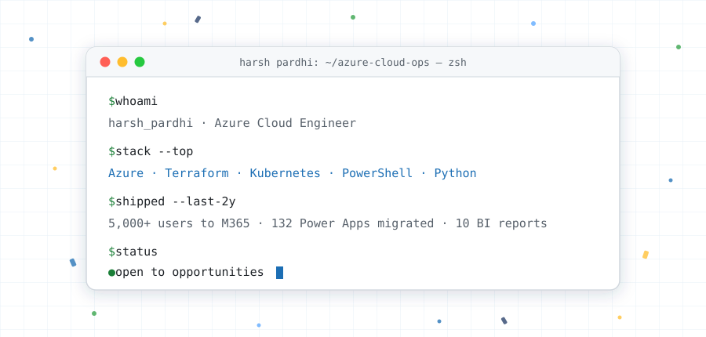

# HARSH PARDHI #

 

 

## 👋 About Me

Software engineer at **Hexaware Technologies**, two years in, working across Azure, Microsoft 365 and automation. Most of my work follows one pattern: something is being done by hand, and it shouldn't be. I find it, script it, and put the output where people can see it.

At work that has meant migrating **5,000+ users** to Microsoft 365 with ShareGate and **5 PowerShell scripts**; deploying **StorageX Analytics** against a client's NetApp ONTAP estate and scripting collection across **9 storage VMs / 2 clusters** into **10 scheduled Power BI reports**; moving **132 Power Apps and 50+ Power Automate flows** to a new tenant; and building **Transcend**, a Power App with a Copilot Studio agent that is now the primary tracking tool for our internal PMO team.

Outside work I build infrastructure projects to go deeper — **InfraGenie**, a two-region Azure DR environment in Terraform, and **KubeScale-Ops**. Being straight about it: my Terraform and Kubernetes depth comes from those projects and one client POC rather than years of production ownership. **AZ-400** next, then **CKA**.

## 🌟 Featured Projects

<table width="100%">
  <tr>
    <td width="50%" valign="top">
      <h4>🤖 InfraGenie — Natural-language Azure provisioning</h4>
      
Turns a plain-English request into a <b>reviewable Terraform plan</b> — mapped to vetted modules, with policy checks and a cost estimate attached to the diff. Nothing reaches the subscription until a <b>human approves the plan</b>. Runs on <b>AKS</b>, with <b>Argo CD</b> for drift detection and <b>Kubecost</b> for node-level cost visibility. State is held remotely in Azure Storage.

      
<i>Architecture and infrastructure design are mine; application code was generated with AI coding agents under structured prompting.</i>

      
<a href="https://github.com/HP04Harsh/infraGenie-AI-Automation-Platform">repo</a> · <a href="https://huggingface.co/HarshG05/InfraGenie-Azure-Expert">HF model (fine-tuned Qwen2.5-Coder-7B, SFT)</a>

      <code>Terraform</code> <code>AKS</code> <code>Argo CD</code> <code>Kubecost</code> <code>Python</code> <code>Qwen2.5-Coder-7B</code>
    </td>
    <td width="50%" valign="top">
      <h4>🛡️ Azure Multi-Region DR</h4>
      
Active–passive two-region disaster recovery defined entirely in <b>Terraform</b> and deployed through <b>GitHub Actions</b>: Traffic Manager routing, auto-scaling VM Scale Sets and geo-replicated storage. Failed over end to end, then documented — including what broke on the way. Destroy-and-rebuild reproducible.

      
<a href="https://github.com/HP04Harsh/azure-multi-region-dr-terraform">repo</a>

      <code>Terraform</code> <code>Traffic Manager</code> <code>VMSS</code> <code>Azure SQL</code> <code>GitHub Actions</code>
    </td>
  </tr>
  <tr>
    <td width="50%" valign="top">
      <h4>💰 KubeScale-Ops — K8s Governance &amp; FinOps</h4>
      
FinOps control plane where <b>Kubecost + Prometheus</b> track spend and utilization. Kubecost surfaced <b>~20% reclaimable spend</b> from rightsizing in the test cluster; manifests are GitOps-managed and validated on a <b>KinD</b> loop before they reach a real cluster.

      
<a href="https://github.com/HP04Harsh/KubeScale-Ops">repo</a>

      <code>Kubecost</code> <code>Prometheus</code> <code>Helm</code> <code>KinD</code> <code>GitOps</code>
    </td>
    <td width="50%" valign="top">
      <h4>🔐 k8s-sec-observability</h4>
      
Kubernetes policy and observability lab: <b>Kyverno</b> admission policies enforcing image and resource rules, <b>Istio</b> for service-to-service traffic, and <b>Grafana</b> dashboards over the cluster. Built to understand what "secure by default" actually costs to run.

      
<a href="https://github.com/HP04Harsh/k8s-sec-observability">repo</a>

      <code>Kyverno</code> <code>Istio</code> <code>Grafana</code> <code>Kubernetes</code>
    </td>
  </tr>
</table>

## 🛠️ Toolbelt

| Category | Technologies |
| :--- | :--- |
| **Cloud** |    |
| **Containers** |     |
| **IaC & Automation** |       |
| **CI/CD & GitOps** |     |
| **Observability & FinOps** |      |
| **Microsoft 365 & Power Platform** |       |
| **Languages & APIs** |     |
| **AI / GenAI** |    |

## 🎯 Currently Building & Learning

- **AZ-400** (DevOps Engineer Expert) — sitting Sep 2026.
- **CKA** (Certified Kubernetes Administrator) — starting after AZ-400.
- **NVIDIA NCA** (AI Infrastructure Operations) — in progress.
- **InfraGenie hardening** — tighter policy checks and a clearer plan-diff review step.

## 🏅 Certifications

- **Microsoft Certified: Azure Administrator Associate (AZ-104)** — Aug 2026 ✅
- **Microsoft Certified: DevOps Engineer Expert (AZ-400)** — expected Sep 2026
- **NVIDIA NCA — AI Infrastructure Operations** — in progress
- **Claude Certified Associate — Anthropic** — expected Sep 2026

## 📈 Contribution Velocity

## 📫 Connect With Me

 

