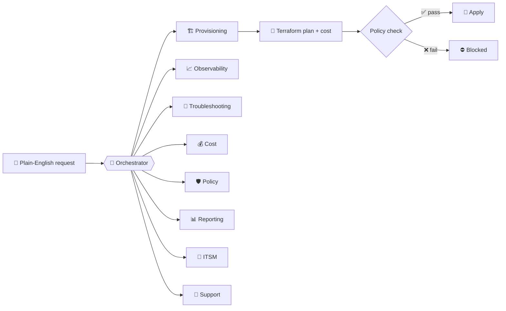

<!-- ═══════════════════════ HEADER ═══════════════════════ -->

  

  

 

<!-- ═══════════════════════ BENTO: ABOUT ═══════════════════════ -->
<table width="100%">
<tr>
<td width="62%" valign="top">

### 👋 About Me

Production **GenAI engineer** building **agentic AI systems** and **enterprise RAG** on Azure. I ship AI agents into live enterprise environments with a focus on **retrieval quality, guardrails, least-privilege access, latency and cost**, not just prototypes.

> *If something is being done by hand (a migration, a permissions audit, a report rebuilt every Monday), it shouldn't be. I find it, script it in PowerShell or Python, and wire it through an AI agent instead of only a cron job.*

</td>
<td width="38%" valign="top">

### ⚡ Quick Facts

📍 **Gondia, Maharashtra**, India
🏢 **Software Engineer**, Hexaware (Chennai)
🗓️ Shipping in production since **Jul 2024**
🎓 **BCA** · CGPA 8.90 → **MCA** (pursuing)
🌏 Open to relocate or remote
⏱️ IST (UTC+5:30) · replies within 24h

</td>
</tr>
<tr>
<td valign="top">

### 🔭 Currently Building

🟢 **InfraGenie v2**: LangGraph + MCP + AKS
🔨 **Secure Enterprise RAG** on Azure AI Search
🔨 **FastAPI** services for AI workloads
🔨 **AKS platform hardening**
📚 Studying for **Terraform Associate** and **AI-103**

</td>
<td valign="top">

### 🎯 Focus Areas

🤖 Agentic AI · RAG · MCP tool-calling
☁️ Azure · AKS · Entra ID · RBAC
⚙️ Automation · IaC · DevOps
🏢 Copilot Studio · Power Platform

</td>
</tr>
</table>

 

<!-- ═══════════════════════ IMPACT ═══════════════════════ -->
<h2 align="center">📊 Impact in Numbers</h2>

<table width="100%">
<tr align="center">
<td width="16%"><h2>5,000+</h2><b>Users</b> OneDrive migrated</td>
<td width="16%"><h2>132</h2><b>Power Apps</b> migrated</td>
<td width="16%"><h2>50+</h2><b>Automate Flows</b> migrated</td>
<td width="16%"><h2>20+</h2><b>Projects</b> tracked in Transcend</td>
<td width="16%"><h2>4</h2><b>Tenants</b> served by my AI agents</td>
<td width="16%"><h2>8</h2><b>AI Agents</b> in the InfraGenie swarm</td>
</tr>
</table>

 

<!-- ═══════════════════════ FEATURED PROJECTS ═══════════════════════ -->
<h2 align="center">🚀 Featured Projects</h2>

<table width="100%">
<tr>
<td colspan="2" valign="top">

## 🤖 InfraGenie: AIOps Platform for Azure
⭐ Flagship · 🟢 Live

An AI-first AIOps platform: **a swarm of 8 specialized agents** (provisioning, observability, troubleshooting, cost, policy, reporting, ITSM, support) behind **one natural-language entry point**.

</td>
</tr>
<tr>
<td width="50%" valign="top">

**🎯 What makes it different**

- 💬 Plain-English requests become **Terraform plans with cost estimates**
- 🛡️ **Guardrails before apply**: every plan passes a policy check
- 🧾 Honest failures: returns **409** when no Azure credentials exist, instead of faking success
- 🔧 **24×7 monitoring agent** remediates failures autonomously
- 🎫 Logs **ServiceNow** tickets with root-cause reports
- 🧠 Model layer runs a **fine-tuned Qwen** model published on HuggingFace

</td>
<td width="50%" valign="top">

**🛠️ Tech Stack**

**🧩 Agent Architecture**

```mermaid
flowchart LR
    A["💬 Plain-English request"] --> B{{"🧠 Orchestrator"}}
    B --> C["🏗️ Provisioning"]
    B --> D["📈 Observability"]
    B --> E["🔧 Troubleshooting"]
    B --> F["💰 Cost"]
    B --> G["🛡️ Policy"]
    B --> H["📊 Reporting"]
    B --> I["🎫 ITSM"]
    B --> J["🙋 Support"]
    C --> K["📝 Terraform plan + cost"]
    K --> L{"Policy check"}
    L -- "✅ pass" --> M["🚀 Apply"]
    L -- "❌ fail" --> N["⛔ Blocked"]
```

</td>
</tr>
<tr>
<td colspan="2" valign="top">

## 🔍 Smart Search & Analyzer: Groq AI Assistant

Multi-modal AI chat on **Groq Llama3-8B** with automatic timestamp-based session management. It analyzes **PDFs, DOCX and images**, and can describe a **live webcam capture** in real time. Chat history persists per session, so you can revisit earlier document Q&A without re-uploading files.

</td>
</tr>
</table>

 

<h3 align="center">☁️ Cloud & DevOps Labs</h3>

<table width="100%">
<tr>
<td width="50%" valign="top">

#### 🛡️ [Azure Multi-Region DR](https://github.com/HP04Harsh/azure-multi-region-dr-terraform)
Two-region disaster recovery (Central India + South India) with VM Scale Sets, Azure SQL and Traffic Manager, all in Terraform.

</td>
<td width="50%" valign="top">

#### ⚙️ [KubeScale-Ops](https://github.com/HP04Harsh/KubeScale-Ops)
AKS governance and FinOps: Kubecost + Prometheus cost tracking, Argo CD GitOps and platform guardrails.

</td>
</tr>
<tr>
<td width="50%" valign="top">

#### 🔐 [k8s-sec-observability](https://github.com/HP04Harsh/k8s-sec-observability)
Kubernetes security lab: Kyverno policies, Grafana dashboards and Terraform automation.

</td>
<td width="50%" valign="top">

#### 🔄 [Azure DevOps Pipeline](https://github.com/HP04Harsh/Azure-Devops-Pipeline)
CI/CD framework: Terraform IaC with Azure DevOps release pipelines and governance.

</td>
</tr>
</table>

**[→ Browse all repositories](https://github.com/HP04Harsh?tab=repositories)**

 

<!-- ═══════════════════════ EXPERIENCE ═══════════════════════ -->
<h2 align="center">💼 Experience</h2>

**Software Engineer · Hexaware Technologies Ltd.** · Chennai, India · *Jul 2024 – Present*

<table width="100%">
<tr>
<td width="33%" valign="top">

#### 🤖 Production Copilot Agents
Own **two Copilot Studio agents** (L1 support + PMO) grounded in SharePoint knowledge, with automated ticket creation and live migration dashboards, serving **four merging tenants**.

</td>
<td width="33%" valign="top">

#### 📊 Transcend
Built a **Power App** with an embedded **Copilot Studio agent** and **Power BI** dashboard. It is now the transformation team's **primary project tracker** across 20+ active projects.

</td>
<td width="33%" valign="top">

#### 🏗️ Terraform Landing Zone
Built a landing zone with **remote state and locking** as a client PoC, enabling repeatable, auditable infrastructure provisioning.

</td>
</tr>
<tr>
<td valign="top">

#### 📦 Migration at Scale
OneDrive for **5,000+ users**, **132 Power Apps**, **50+ Power Automate flows**, plus a **StorageX Analytics** engagement across 9 storage VMs. This earned **formal client appreciation**.

</td>
<td valign="top">

#### 🔐 Security & Compliance
Partnered with security teams to apply **RBAC and least-privilege access reviews** across every migrated Microsoft 365 tenant before go-live sign-off.

</td>
<td valign="top">

#### 📘 Runbooks & Playbooks
Authored **incident runbooks and escalation playbooks** for the L1 support agent, reducing repeat manual triage on common migration tickets.

</td>
</tr>
</table>

 

<!-- ═══════════════════════ TECH STACK ═══════════════════════ -->
<h2 align="center">🛠️ Tech Stack</h2>

 

<table width="100%">
<tr>
<td width="24%"><b>🤖 GenAI & Agentic AI</b></td>
<td>

</td>
</tr>
<tr>
<td><b>☁️ Cloud & AI Platform</b></td>
<td>

</td>
</tr>
<tr>
<td><b>⚙️ Engineering & DevOps</b></td>
<td>

</td>
</tr>
<tr>
<td><b>🏢 Enterprise Automation</b></td>
<td>

</td>
</tr>
<tr>
<td><b>📊 Observability</b></td>
<td>

</td>
</tr>
</table>

 

<!-- ═══════════════════════ ACHIEVEMENTS ═══════════════════════ -->
<h2 align="center">🏆 Achievements</h2>

<table width="100%">
<tr>
<td width="33%" valign="top">

#### 🥇 Formal Client Appreciation
Recognised for enterprise-scale M365 migration plus the StorageX Analytics engagement.

</td>
<td width="33%" valign="top">

#### 🚀 AI Agents in Production
Shipped Copilot Studio agents into live enterprise environments across 4 tenants.

</td>
<td width="33%" valign="top">

#### 🤗 Published Fine-Tuned Model
[InfraGenie-Azure-Expert](https://huggingface.co/HarshG05/InfraGenie-Azure-Expert): a Qwen model fine-tuned for Azure ops, on HuggingFace.

</td>
</tr>
<tr>
<td valign="top">

#### 📦 5,000+ Users Migrated
OneDrive migration with RBAC and least-privilege reviews before every go-live.

</td>
<td valign="top">

#### 🧠 8-Agent AIOps Swarm
Designed and shipped InfraGenie, live and open-source, with policy-gated Terraform applies.

</td>
<td valign="top">

#### 🎓 Academic
BCA with **CGPA 8.90 / 10**, now pursuing an MCA (2025 – 2028).

</td>
</tr>
</table>

 

<h3 align="center">📜 Certifications</h3>

<table width="100%">
<tr align="center">
<td width="25%">

 <b>Azure Fundamentals</b> ✅ Certified · Mar 2025
</td>
<td width="25%">

 <b>Azure Administrator Associate</b> ✅ Certified · Oct 2025
</td>
<td width="25%">

 <b>HashiCorp (004)</b> 🗓️ Scheduled
</td>
<td width="25%">

 <b>Azure AI Apps & Agents Developer</b> 🗓️ Scheduled
</td>
</tr>
</table>

 

<!-- ═══════════════════════ GITHUB ANALYTICS ═══════════════════════ -->
<h2 align="center">📈 GitHub Analytics</h2>

<a href="https://github.com/HP04Harsh">
<picture>
  <source media="(prefers-color-scheme: dark)" srcset="https://github-readme-stats.vercel.app/api?username=HP04Harsh&show_icons=true&theme=tokyonight&hide_border=true&count_private=true&include_all_commits=true&bg_color=0D1117"/>
  <source media="(prefers-color-scheme: light)" srcset="https://github-readme-stats.vercel.app/api?username=HP04Harsh&show_icons=true&theme=default&hide_border=true&count_private=true&include_all_commits=true&icon_color=0A66C2&title_color=0F172A"/>
  
</picture>
</a>
<a href="https://github.com/HP04Harsh">
<picture>
  <source media="(prefers-color-scheme: dark)" srcset="https://github-readme-stats.vercel.app/api/top-langs/?username=HP04Harsh&layout=compact&theme=tokyonight&hide_border=true&bg_color=0D1117"/>
  <source media="(prefers-color-scheme: light)" srcset="https://github-readme-stats.vercel.app/api/top-langs/?username=HP04Harsh&layout=compact&theme=default&hide_border=true&title_color=0F172A"/>
  
</picture>
</a>

 

<a href="https://github.com/HP04Harsh">
<picture>
  <source media="(prefers-color-scheme: dark)" srcset="https://streak-stats.demolab.com/?user=HP04Harsh&theme=tokyonight&hide_border=true&background=0D1117"/>
  <source media="(prefers-color-scheme: light)" srcset="https://streak-stats.demolab.com/?user=HP04Harsh&theme=default&hide_border=true"/>
  
</picture>
</a>

  

<picture>
  <source media="(prefers-color-scheme: dark)" srcset="https://github-readme-activity-graph.vercel.app/graph?username=HP04Harsh&theme=tokyo-night&hide_border=true&bg_color=0D1117&area=true"/>
  <source media="(prefers-color-scheme: light)" srcset="https://github-readme-activity-graph.vercel.app/graph?username=HP04Harsh&theme=github-light&hide_border=true&area=true"/>
  
</picture>

 

<!-- ═══════════════════════ CONNECT ═══════════════════════ -->
<h2 align="center">📫 Let's Connect</h2>

Hiring for **Applied AI / GenAI / Agentic AI** roles? I'd love to talk.

  

### ✨ *Automate the manual parts. Build agents that scale.* ✨

