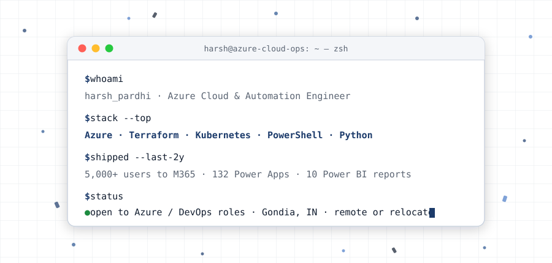

# Harsh Pardhi

 

 

---

## About

Cloud and AI engineer at **Hexaware Technologies**, two years in — building automation, enterprise Copilots, and (increasingly) GenAI agents on Azure.

My work follows one pattern: something is being done by hand — a migration, a permissions audit, a report rebuilt every Monday, a ticket queue at 2 a.m. — and it shouldn't be. I find it, script it in **PowerShell** or **Python**, and these days I wire it through an **AI agent** instead of only a cron job.

At work that has meant migrating **5,000+ users** of on-premises OneDrive data to **Microsoft 365** with ShareGate and PowerShell (overnight cutovers running unsupervised); deploying **StorageX Analytics** against **9 storage VMs across 2 clusters** into **10 Power BI reports** the client formally thanked us for; migrating **132 Power Apps and 50+ Power Automate flows** across 4 tenants; building **Transcend**, a Power App with a Copilot Studio agent that now runs 20+ projects; and delivering a **Terraform landing zone POC** for a client evaluation. On the same engagements I deployed **two production Copilot Studio agents** — an L1 support agent and a PMO assistant — grounded in internal SharePoint FAQs, wired to ticketing, live across all four tenants.

Outside work I build to go deeper: **InfraGenie**, an AIOps platform for Azure that uses a local LLM (Qwen2.5-Coder on Ollama) with structured prompts and self-remediation loops; a **two-region DR environment** in Terraform; and labs on **AKS GitOps**, **policy enforcement**, and observability.

Currently doubling down on **GenAI engineering**: agentic workflows with **LangGraph**, **Model Context Protocol (MCP)**, **RAG** on Azure AI Search, **LLMOps**, and deploying AI workloads on **AKS**. Working toward **AZ-104** (Oct 2026), then **AZ-400** and **AI-102**.

**📍 Gondia, Maharashtra · 🏢 Hexaware, Chennai · 🌏 Open to GenAI / AI Platform / Cloud roles · ⏱ IST (UTC+5:30)**

---

## Featured Projects

<table width="100%">
<tr>
<td width="50%" valign="top">

### 🤖 InfraGenie — AIOps Platform for Azure

A self-service platform for Azure infrastructure. Engineers describe what they need in plain English; the platform matches the request to a reusable **Terraform** module and runs policy checks before anything is applied.

After deployment it keeps watching — it **remediates common failures on its own** and logs a **ServiceNow** ticket. A reporting agent publishes **10+ operational reports** on FinOps spend, orphaned VMs, and drift.

> Built with zero external cost using **Qwen2.5-Coder locally on Ollama in Docker** as the coding assistant. Architected against SOLID principles with structured prompt engineering.

`Python` `Terraform` `Docker` `Ollama` `Qwen2.5-Coder` `ServiceNow`

[**→ Repository**](https://github.com/HP04Harsh/infragenie-aiops) · [**→ Hugging Face**](https://huggingface.co/HarshG05/InfraGenie-Azure-Expert)

</td>
<td width="50%" valign="top">

### 🛡️ Azure Multi-Region Disaster Recovery

A two-region, three-tier Azure environment — **if the primary region fails, how fast can the app come back?** Provisioned entirely in **Terraform** across Central and South India.

**VM Scale Sets** serve web/app tiers, geo-replicated **Azure SQL** holds data, **Traffic Manager** + Load Balancers route traffic.

> Reusable modules with remote state/locking, active/passive topology to keep standby cost proportionate to the RTO rather than doubling the estate.

`Terraform` `Traffic Manager` `VM Scale Sets` `Azure SQL`

[**→ Repository**](https://github.com/HP04Harsh/azure-multi-region-dr-terraform)

</td>
</tr>
<tr>
<td width="50%" valign="top">

### ⚙️ KubeScale-Ops — AKS Governance & FinOps

A Kubernetes lab for cost and governance: **Kubecost** and **Prometheus** track spend and utilization; manifests are GitOps-managed and validated on a **KinD** loop before reaching a real cluster.

Reusable **Terraform** modules with platform guardrails for repeatable AKS delivery.

`AKS` `Terraform` `Kubecost` `Prometheus` `Helm` `GitOps`

[**→ Repository**](https://github.com/HP04Harsh/KubeScale-Ops)

</td>
<td width="50%" valign="top">

### 🔐 k8s-sec-observability

A Kubernetes policy and observability lab: **Kyverno** admission policies enforce image and resource rules; **Grafana** dashboards over cluster metrics and traces.

Built to understand what "secure by default" actually costs to run day-to-day.

`Kubernetes` `Kyverno` `Terraform` `Grafana` `Prometheus`

[**→ Repository**](https://github.com/HP04Harsh/k8s-sec-observability)

</td>
</tr>
</table>

---

## Toolbelt

| | |
| :--- | :--- |
| **Azure** |       |
| **IaC & DevOps** |        |
| **GenAI / Agents** |    -4B5563?style=flat-square) -6B21A8?style=flat-square)   |
| **Observability** |    |
| **Scripting** |    -009688?style=flat-square&logo=fastapi&logoColor=white)  |
| **Microsoft 365** |     |
| **OS & Networking** |    |

---

## Certifications

| Certification | Issuer | Status |
| :--- | :--- | :--- |
| **Azure Fundamentals (AZ-900)** | Microsoft | ✅ Mar 2025 |
| **Azure Administrator Associate (AZ-104)** | Microsoft | 🟡 Targeting Oct 2026 |
| **DevOps Engineer Expert (AZ-400)** | Microsoft | 📅 Planned — Nov 2026 |
| **Terraform Associate (004)** | HashiCorp | 🔄 In progress |
| **Azure AI Engineer Associate (AI-102)** | Microsoft | 📅 Planned — Feb 2027 |

## Currently Building

- **GenAI & Agents deep-dive** — LangGraph agents, MCP servers, RAG on Azure AI Search, and LLMOps observability. Deploying agent workloads on AKS.
- **AZ-104** — Azure Administrator (this month).
- **Python + FastAPI** — production-grade async APIs for AI services.
- **InfraGenie v2** — adding MCP tools, LangGraph multi-agent architecture, and AKS deployment.
- **Production Kubernetes depth** — cluster operations, GitOps, cost governance, troubleshooting.

---

## GitHub Activity

---

## Get in Touch

 

*Automate the manual parts. Build agents that scale.*

